# TitanGym

## 👥 Miembros del Equipo
| Nombre y Apellidos | Correo URJC | Usuario GitHub |
|:--- |:--- |:--- |
| Manuel García Muñoz | m.garciamu.2024@alumnos.urjc.es | manugrmz |
| Daniel Puga Blanco | d.puga.2024@alumnos.urjc.es | D_Puga |
| Genshen Lin | g.lin.2024@alumnos.urjc.es | gln16 |
| Héctor Bonilla Labraca | h.bonilla.2024@alumnos.urjc.es | hectorbn |

---

## 🎭 **Preparación: Definición del Proyecto**

### **Descripción del Tema**
La aplicación es un sistema web para la gestión de un gimnasio. Permite a los usuarios registrarse, consultar clases disponibles, reservar actividades y gestionar su perfil personal.
El sector al que pertenece es el fitness y bienestar, y aporta valor al usuario facilitando la organización de sus entrenamientos, la reserva de clases y el acceso a información relevante del gimnasio.
Para los administradores, la aplicación ofrece herramientas para gestionar usuarios, clases y actividades de forma centralizada.

### **Entidades**
Indicar las entidades principales que gestionará la aplicación y las relaciones entre ellas:

1. **[Entidad 1]**: Usuario
2. **[Entidad 2]**: Clase
3. **[Entidad 3]**: Actividad/Servicio
4. **[Entidad 4]**: Review

**Relaciones entre entidades:**
- Usuario-Reserva: un usuario puede tener múltiples reservas. RELACIÓN 1:N.
- Clase-Reserva: una clase puede tener múltiples reservas, pero cada reserva tiene una única clase. RELACIÓN 1:N.
- Actividad-Reserva: una actividad puede tener múltiples reservas. RELACIÓN 1:N.
- Usuario-Clase: un usuario puede apuntarse a muchas clases y una clase puede tener muchos usuarios. RELACIÓN N:M.
- Usuario-Actividad: RELACION N:M.

### **Permisos de los Usuarios**
Describir los permisos de cada tipo de usuario e indicar de qué entidades es dueño:

* **Usuario Anónimo**: 
  - Permisos: Ver la página principal, consultar listado de clases, consultar el listado de actividades, acceder el formulario de registro, acceder al login.
  - No es dueño de ninguna entidad

* **Usuario Registrado**: 
  - Permisos: Iniciar y cerrar sesión, editar su perfil, ver el detalle de clases y actividades, reservar clases y actividades, cancelar sus propias actividades.
  - Es dueño de: su perfil y sus reviews.

* **Administrador**: 
  - Permisos: Gestionar todos los usuarios, crear, editar y eliminar clases y actividades, ver todas las reservas, y modificar datos generales del gimnasio.
  - Es dueño de: todas las clases, reviews, actividades, y usuarios(a nivel gestión).

### **Imágenes**
Indicar qué entidades tendrán asociadas una o varias imágenes:

- **[Entidad con imágenes 1]**: Usuario--> Una imagen de perfil(avatar).
- **[Entidad con imágenes 2]**: Clase--> Una imagen representativa de la clase(por ejemplo de yoga, zumba..).
- **[Entidad con imágenes 3]**: Actividad/Servicio--> Imagen ilustrativa del servicio(nutrición, fisitoterapia...).

---

## 🛠 **Práctica 1: Maquetación de páginas con HTML y CSS**

### **Vídeo de Demostración**
📹 **[Enlace al vídeo en YouTube](https://youtu.be/4f7Mlke2Ptg)**
> Vídeo mostrando las principales funcionalidades de la aplicación web.

### **Diagrama de Navegación**
Diagrama que muestra cómo se navega entre las diferentes páginas de la aplicación:


> [Descripción opcional del flujo de navegación: Ej: "El usuario puede acceder desde la página principal a todas las secciones mediante el menú de navegación. Los usuarios anónimos solo tienen acceso a las páginas públicas, mientras que los registrados pueden acceder a su perfil y panel de usuario."]

### **Capturas de Pantalla y Descripción de Páginas**

#### **1. Página Principal / Inicio**


> ["Página de inicio que muestra opción a registrarse o en su defecto a iniciar sesión, podemos ver las múltiples opciones de arriba a al derecha siendo la más destacada la de MI PERFIL en la que si se estuviera iniciado sesión podría ver sus datos personales"]

#### **2.Las clases / Inicio**
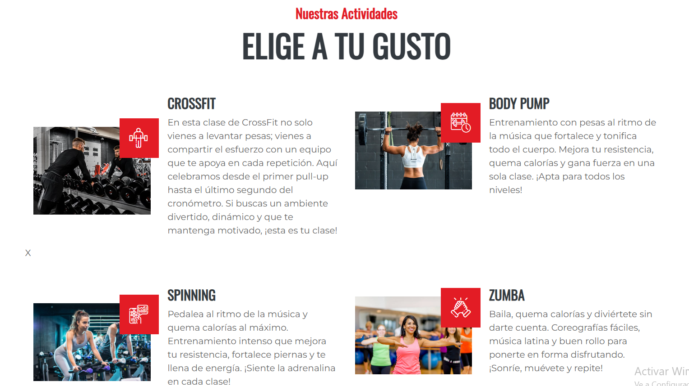

> ["Bajando en el index, encontramos la lista de clases activas que pueden visionar cualquier usuario."]

#### **3.Los servicios / Inicio**
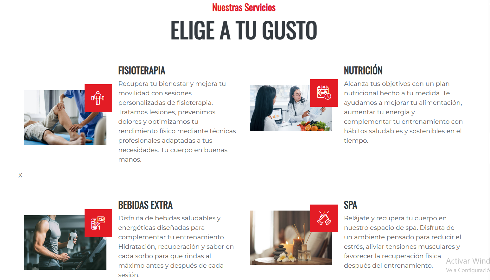

> ["Bajando aún más encontramos los servicios disponibles"]

#### **4.Los servicios(precios) / Precio**
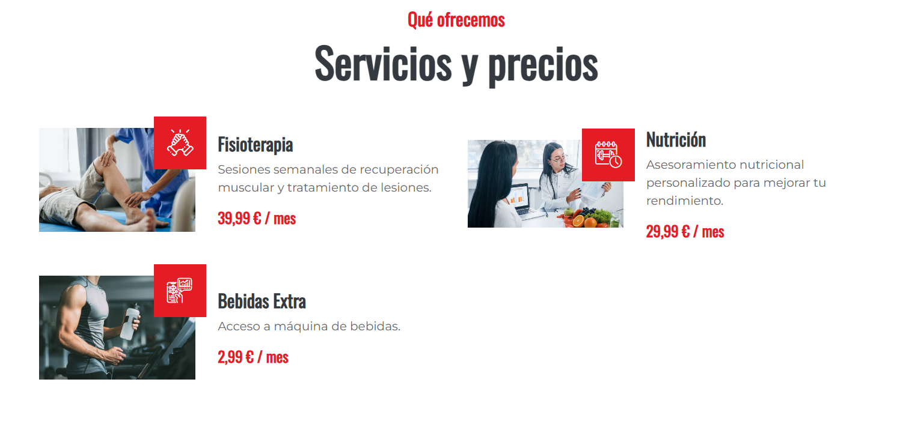

> ["En QUE OFRECEMOS(feature.html) encontramos los precios disponibles de nuestros servicios activos(actividades no ya que no requieren de otra sucripción)"]


#### **5.Perfil inicio/ Perfil**
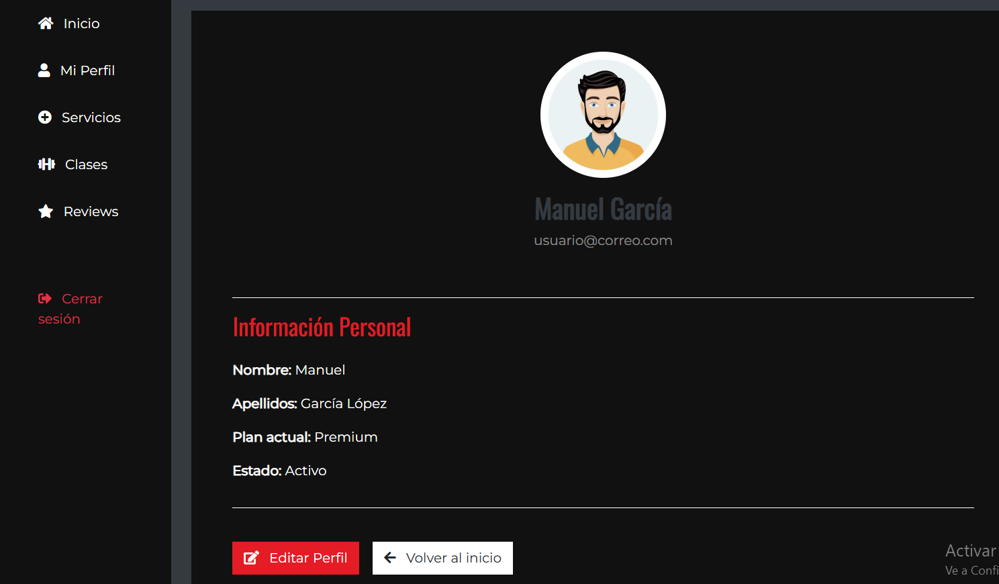

> ["Aquí encontramos en el botón de mi perfil(ya iniciado sesión) los datos de su cuenta pudiendolos editar, además de ver sus clases y servicios en propiedad además de sus reviews"]

#### **6.Perfil Servicios/ Perfil**
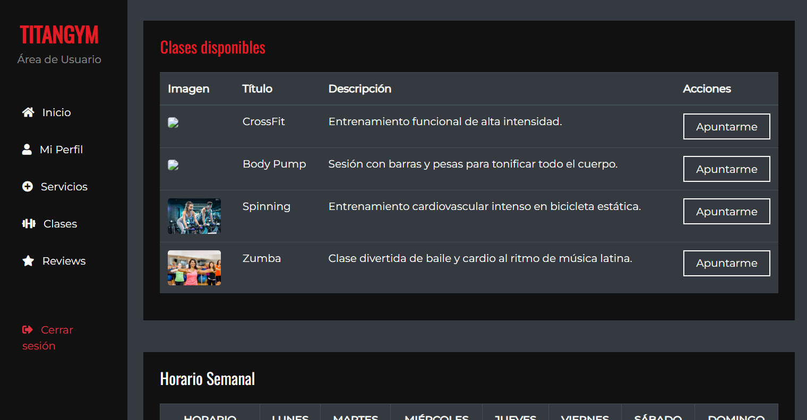

> ["Podemos desde aquí suscribirnos a servicios o una vez ya sucritos eliminarlosde suscripción "]

#### **7.Perfil Clases/ Perfil**


> ["De igual manera que con los servicios hacemos con las clases "]

#### **8.Perfil Reviews/ Perfil**
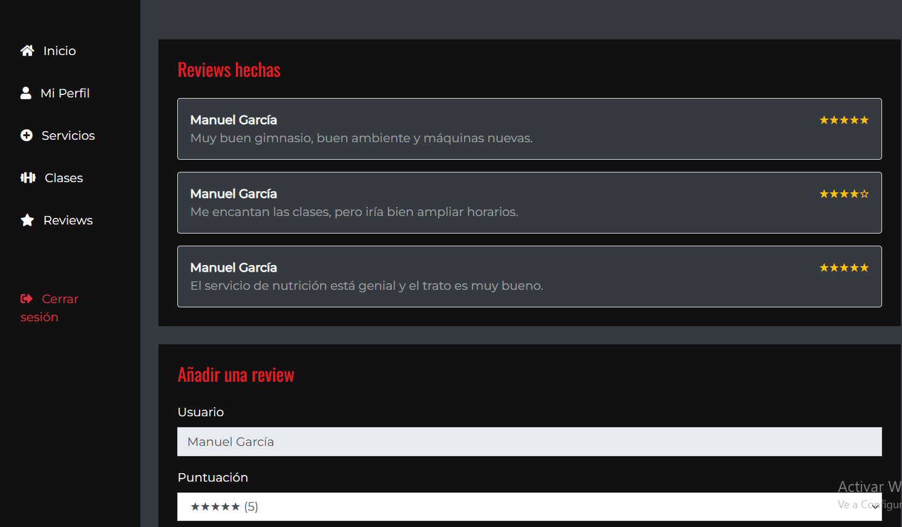

> ["Desde aquí podemos ver nuestras reviews hechas y añadir más(solo pueden añadir susuarios registrados) "]

#### **9.Admin Inicio/ Admin**
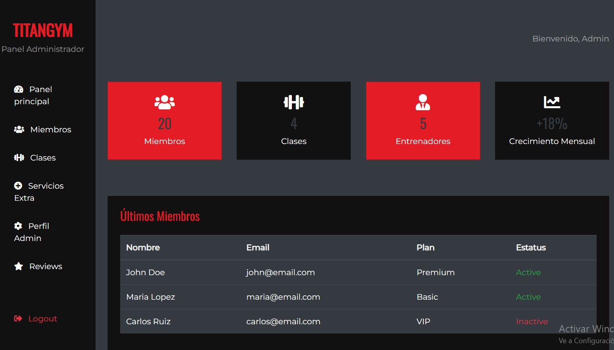

> ["Es el inicio de la página del Admin, en su lateral con todas las opciones posibles "]

#### **10.Admin Miembros/ Admin**
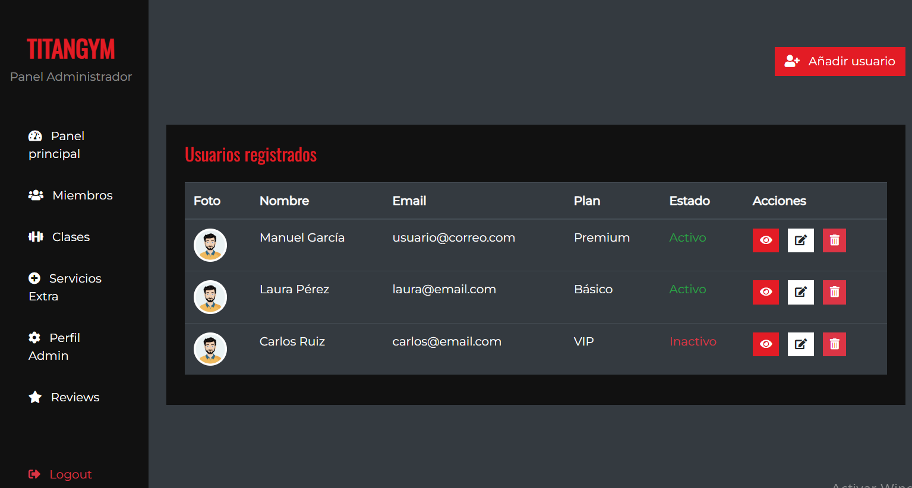

> ["Aquí el admin puede eliminar, editar y ver el perfil de los miembros registrados del gimnasio "]

#### **11.Admin Clases/ Admin**
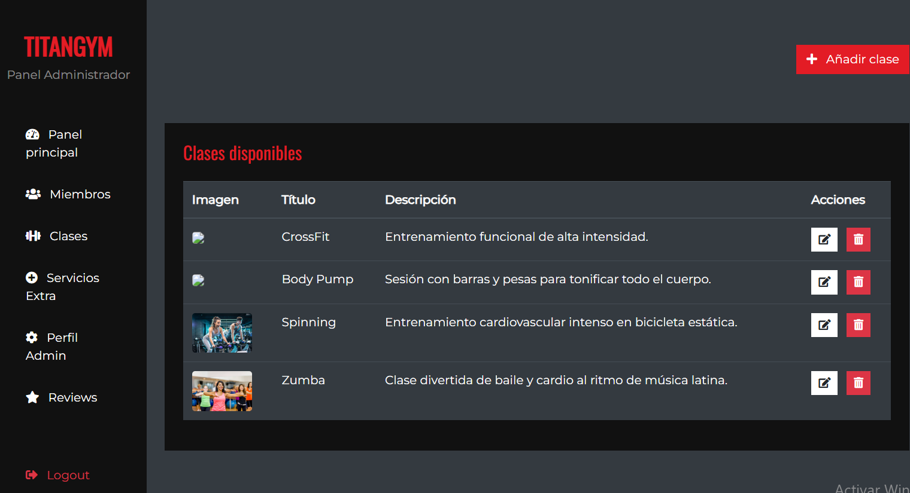

> ["Aquí puede gestionar las clases disponibles además de añadir más "]

#### **12.Admin Servicios/ Admin**
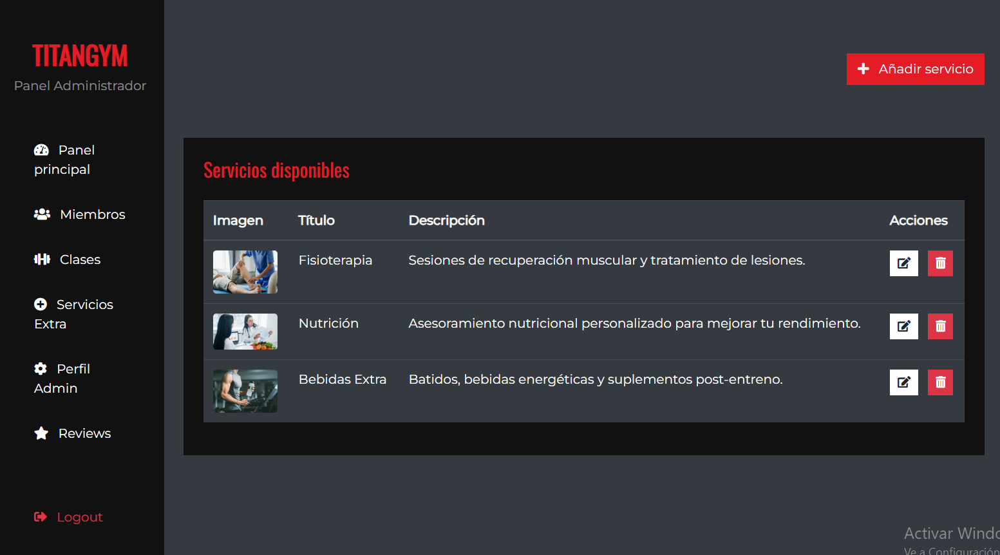

> [Descripción breve: Ej: "Aquí puede gestionar los servicios disponibles además de añadir más "]

#### **13.Admin Panel/ Admin**
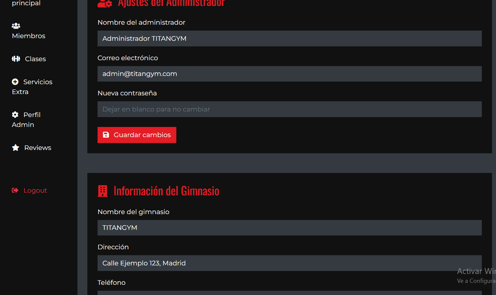

> ["Aquí puede editar temas más centrados con su perfil y datos del gimnasio como horario, número etc.. "]

#### **14.Admin Panel/ Admin**
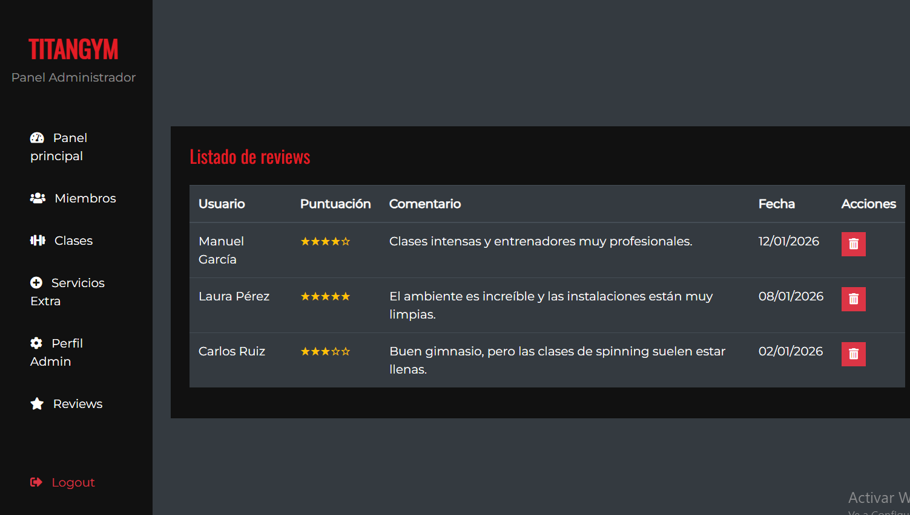

> ["Muestra en esta pantalla las reviews de la gente, pudiendo eliminar en caso de que no sea correcta "]

#### **15.Contacto/ Contacto**
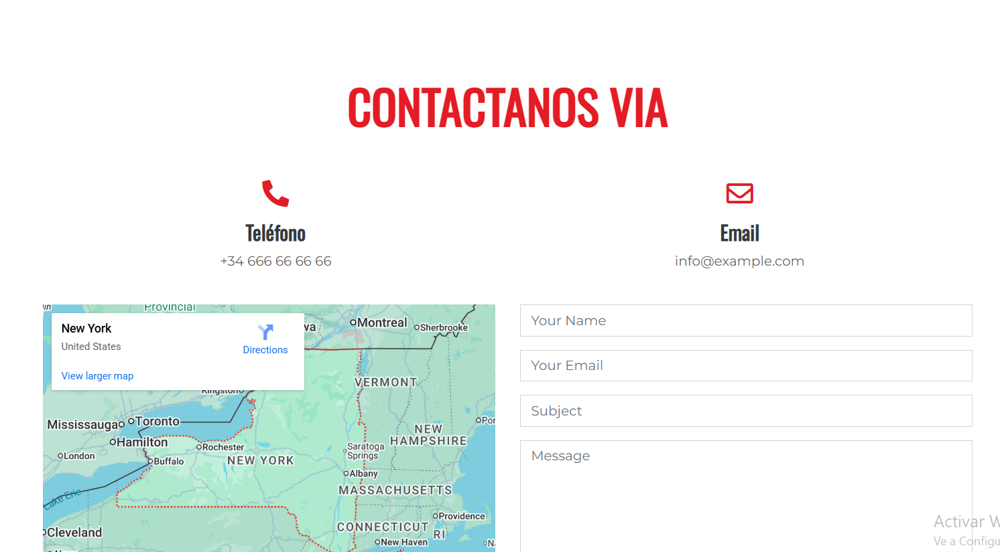

> ["En esta pantalla podemos encontrar los contactos y ubicación en el mapa para ubicar el gimnasio"]

#### **16.Registro/ Registro**
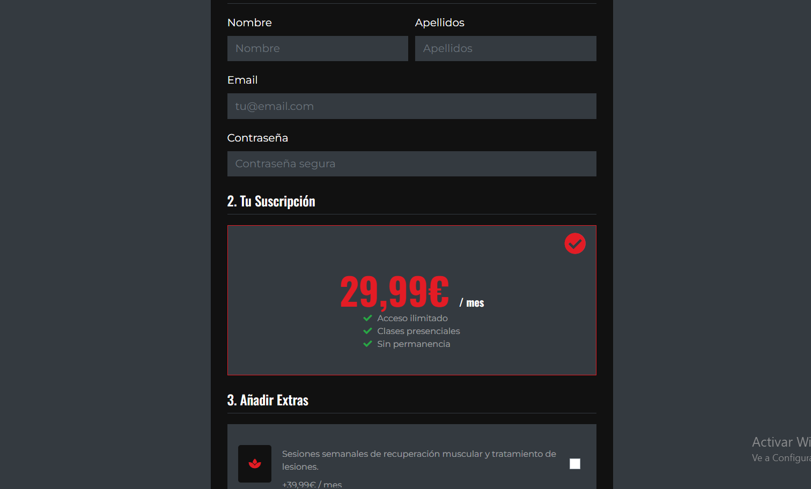

> ["Podemos ver la pantalla de registro con todas sus funcionalidades"]

#### **17.Inicar Sesión/ Iniciar Sesión**
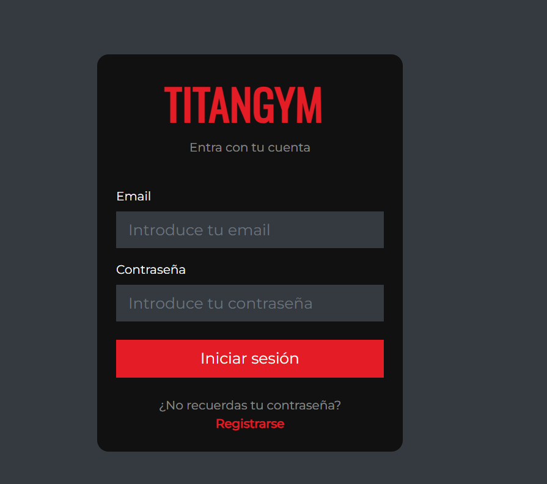

> ["Inicio de sesión con su usuario y contraseña"]


### **Participación de Miembros en la Práctica 1**

#### **Alumno 1 - Manuel García Muñoz**

Principalmente la realización del panel admin y todas sus funcionalidades, además de ayudar en otras partes de la web.

| Nº    | Commits      | Files      |
|:------------: |:------------:| :------------:|
|1| [PANEL ADMIN](https://github.com/DWS-2026/project-grupo-15/commit/df2ecee25a182267b187729edb4dd67e7b3d2cc2)  | [admin.html](https://github.com/DWS-2026/project-grupo-15/blob/main/admin.html)   |
|2| [LOGIN Y MAS](https://github.com/DWS-2026/project-grupo-15/commit/52ca49ab0c837b58dc52f49f3a9d10c749454fe2)  | [login.html](https://github.com/DWS-2026/project-grupo-15/blob/main/login.html)   |
|3| [ADMIN LISTA USUARIOS](https://github.com/DWS-2026/project-grupo-15/commit/1c731c0b4a21cf28c1f12b6ad675684c77cde54d)  | [admin-usuarios.html](https://github.com/DWS-2026/project-grupo-15/blob/main/admin-usuarios.html)   |
|4| [SELECCION PLANTILLA](https://github.com/DWS-2026/project-grupo-15/commit/107028bcec4f13066262b1b0b6fd37b004fbf1aa)  | [index.html](https://github.com/DWS-2026/project-grupo-15/blob/main/index.html)   |
|5| [CREACION PERFIL USUARIO Y DEMAS](https://github.com/DWS-2026/project-grupo-15/commit/54ab67c3ca03cb19b94bdf204750107fe5ff0830#diff-3985f9cbed74f52f435a1951d84ebda87755c78fd23f513c6211f6b8f6fc9698)  | [perfil.html](https://github.com/DWS-2026/project-grupo-15/blob/main/perfil.html)   |

---

#### **Alumno 2 - Daniel Puga Blanco**

Encargado de la creación del login y del registro, además de la modificación de la página de clases y de la de contacto, además de pequeñas correcciones en el codigo de otras páginas.

| Nº    | Commits      | Files      |
|:------------: |:------------:| :------------:|
|1| [PÁGINA LOGIN](https://github.com/DWS-2026/project-grupo-15/commit/89a75f14019687a329acdf8a7a3a2a55470d6c44)  | [login.html](URL_archivo_1)   |
|2| [AÑADIR PÁGINA REGISTRO](https://github.com/DWS-2026/project-grupo-15/commit/8cf1c6a263d9799ec468a2cf1e1060134a48e2b6)  | [registro.html](https://github.com/DWS-2026/project-grupo-15/blob/8cf1c6a263d9799ec468a2cf1e1060134a48e2b6/registro.html)   |
|3| [PÁGINA CLASES](https://github.com/DWS-2026/project-grupo-15/commit/e34a23f51a17a902e90002fe79c8b65c323a9d4a)  | [class.html](https://github.com/DWS-2026/project-grupo-15/blob/e34a23f51a17a902e90002fe79c8b65c323a9d4a/class.html)   |
|4| [PÁGINA CONTACTO](https://github.com/DWS-2026/project-grupo-15/commit/ee4ee219ba1f62133cd0b604d263092dc554c58b)  | [contact.hmtl](https://github.com/DWS-2026/project-grupo-15/blob/ee4ee219ba1f62133cd0b604d263092dc554c58b/contact.html)   |
|5| [CORRECIÓN DE ERRORES](https://github.com/DWS-2026/project-grupo-15/commit/31a4f309bde761bbf034516c779dc28933b5ded9)  | [contact.hmtl/class.html/feature.hmtl](https://github.com/DWS-2026/project-grupo-15/blob/ee4ee219ba1f62133cd0b604d263092dc554c58b/contact.html)   |
---

#### **Alumno 3 - [Genshen Lin]**

Realización de la página del usuario en cuestión, mejora de la página de registro y labores corrección de errores.

| Nº    | Commits      | Files      |
|:------------: |:------------:| :------------:|
|1| [Página del perfil del usuario](URL_commit_1)  | [Archivo1](URL_archivo_1)   |
|2| [Listado de clases que se puede apuntar el usuario](URL_commit_2)  | [Archivo2](URL_archivo_2)   |
|3| [Listado de servicios que se puede suscribir el usuario](URL_commit_3)  | [Archivo3](URL_archivo_3)   |
|4| [Actualización página de registro con funciones extra y visuales](URL_commit_4)  | [Archivo4](URL_archivo_4)   |
|5| [Mejora general en la web, corrigiendo errores, traduciendo ...](URL_commit_5)  | [Archivo5](URL_archivo_5)   |

---

#### **Alumno 4 - [Nombre Completo]**

[Descripción de las tareas y responsabilidades principales del alumno en el proyecto]

| Nº    | Commits      | Files      |
|:------------: |:------------:| :------------:|
|1| [Descripción commit 1](URL_commit_1)  | [Archivo1](URL_archivo_1)   |
|2| [Descripción commit 2](URL_commit_2)  | [Archivo2](URL_archivo_2)   |
|3| [Descripción commit 3](URL_commit_3)  | [Archivo3](URL_archivo_3)   |
|4| [Descripción commit 4](URL_commit_4)  | [Archivo4](URL_archivo_4)   |
|5| [Descripción commit 5](URL_commit_5)  | [Archivo5](URL_archivo_5)   |

---

## 🛠 **Práctica 2: Web con HTML generado en servidor**

### **Vídeo de Demostración**
📹 **[Enlace al vídeo en YouTube](https://www.youtube.com/watch?v=x91MPoITQ3I)**
> Vídeo mostrando las principales funcionalidades de la aplicación web.

### **Navegación y Capturas de Pantalla**

#### **Diagrama de Navegación**

Solo si ha cambiado.

#### **Capturas de Pantalla Actualizadas**

Solo si han cambiado.

### **Instrucciones de Ejecución**

#### **Requisitos Previos**
- **Java**: versión 21 o superior
- **Maven**: versión 3.8 o superior
- **MySQL**: versión 8.0 o superior
- **Git**: para clonar el repositorio

#### **Pasos para ejecutar la aplicación**

1. **Clonar el repositorio**
   ```bash
   git clone https://github.com/[usuario]/[nombre-repositorio].git
   cd [nombre-repositorio]
   ```

2. **AQUÍ INDICAR LO SIGUIENTES PASOS**

#### **Credenciales de prueba**
- **Usuario Admin**: usuario: `admin`, contraseña: `admin`
- **Usuario Registrado**: usuario: `user`, contraseña: `user`

### **Diagrama de Entidades de Base de Datos**

Diagrama mostrando las entidades, sus campos y relaciones:


> [Descripción opcional: Ej: "El diagrama muestra las 4 entidades principales: Usuario, Producto, Pedido y Categoría, con sus respectivos atributos y relaciones 1:N y N:M."]

### **Diagrama de Clases y Templates**

Diagrama de clases de la aplicación con diferenciación por colores o secciones:

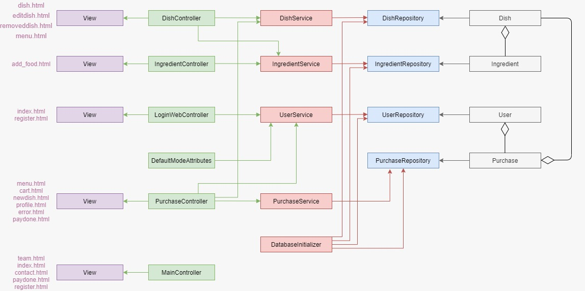

> [Descripción opcional del diagrama y relaciones principales]

### **Participación de Miembros en la Práctica 2**

#### **Alumno 1 - [Nombre Completo]**

[Descripción de las tareas y responsabilidades principales del alumno en el proyecto]

| Nº    | Commits      | Files      |
|:------------: |:------------:| :------------:|
|1| [Descripción commit 1](URL_commit_1)  | [Archivo1](URL_archivo_1)   |
|2| [Descripción commit 2](URL_commit_2)  | [Archivo2](URL_archivo_2)   |
|3| [Descripción commit 3](URL_commit_3)  | [Archivo3](URL_archivo_3)   |
|4| [Descripción commit 4](URL_commit_4)  | [Archivo4](URL_archivo_4)   |
|5| [Descripción commit 5](URL_commit_5)  | [Archivo5](URL_archivo_5)   |

---

#### **Alumno 2 - [Nombre Completo]**

[Descripción de las tareas y responsabilidades principales del alumno en el proyecto]

| Nº    | Commits      | Files      |
|:------------: |:------------:| :------------:|
|1| [Descripción commit 1](URL_commit_1)  | [Archivo1](URL_archivo_1)   |
|2| [Descripción commit 2](URL_commit_2)  | [Archivo2](URL_archivo_2)   |
|3| [Descripción commit 3](URL_commit_3)  | [Archivo3](URL_archivo_3)   |
|4| [Descripción commit 4](URL_commit_4)  | [Archivo4](URL_archivo_4)   |
|5| [Descripción commit 5](URL_commit_5)  | [Archivo5](URL_archivo_5)   |

---

#### **Alumno 3 - [Nombre Completo]**

[Descripción de las tareas y responsabilidades principales del alumno en el proyecto]

| Nº    | Commits      | Files      |
|:------------: |:------------:| :------------:|
|1| [Descripción commit 1](URL_commit_1)  | [Archivo1](URL_archivo_1)   |
|2| [Descripción commit 2](URL_commit_2)  | [Archivo2](URL_archivo_2)   |
|3| [Descripción commit 3](URL_commit_3)  | [Archivo3](URL_archivo_3)   |
|4| [Descripción commit 4](URL_commit_4)  | [Archivo4](URL_archivo_4)   |
|5| [Descripción commit 5](URL_commit_5)  | [Archivo5](URL_archivo_5)   |

---

#### **Alumno 4 - [Nombre Completo]**

[Descripción de las tareas y responsabilidades principales del alumno en el proyecto]

| Nº    | Commits      | Files      |
|:------------: |:------------:| :------------:|
|1| [Descripción commit 1](URL_commit_1)  | [Archivo1](URL_archivo_1)   |
|2| [Descripción commit 2](URL_commit_2)  | [Archivo2](URL_archivo_2)   |
|3| [Descripción commit 3](URL_commit_3)  | [Archivo3](URL_archivo_3)   |
|4| [Descripción commit 4](URL_commit_4)  | [Archivo4](URL_archivo_4)   |
|5| [Descripción commit 5](URL_commit_5)  | [Archivo5](URL_archivo_5)   |

---

## 🛠 **Práctica 3: Incorporación de una API REST a la aplicación web, análisis de vulnerabilidades y contramedidas**

### **Vídeo de Demostración**
📹 **[Enlace al vídeo en YouTube](https://www.youtube.com/watch?v=x91MPoITQ3I)**
> Vídeo mostrando las principales funcionalidades de la aplicación web.

### **Documentación de la API REST**

#### **Especificación OpenAPI**
📄 **[Especificación OpenAPI (YAML)](/api-docs/api-docs.yaml)**

#### **Documentación HTML**
📖 **[Documentación API REST (HTML)](https://raw.githack.com/[usuario]/[repositorio]/main/api-docs/api-docs.html)**

> La documentación de la API REST se encuentra en la carpeta `/api-docs` del repositorio. Se ha generado automáticamente con SpringDoc a partir de las anotaciones en el código Java.

### **Diagrama de Clases y Templates Actualizado**

Diagrama actualizado incluyendo los @RestController y su relación con los @Service compartidos:


#### **Credenciales de Usuarios de Ejemplo**

| Rol | Usuario | Contraseña |
|:---|:---|:---|
| Administrador | admin | admin123 |
| Usuario Registrado | user1 | user123 |
| Usuario Registrado | user2 | user123 |

### **Participación de Miembros en la Práctica 3**

#### **Alumno 1 - [Nombre Completo]**

[Descripción de las tareas y responsabilidades principales del alumno en el proyecto]

| Nº    | Commits      | Files      |
|:------------: |:------------:| :------------:|
|1| [Descripción commit 1](URL_commit_1)  | [Archivo1](URL_archivo_1)   |
|2| [Descripción commit 2](URL_commit_2)  | [Archivo2](URL_archivo_2)   |
|3| [Descripción commit 3](URL_commit_3)  | [Archivo3](URL_archivo_3)   |
|4| [Descripción commit 4](URL_commit_4)  | [Archivo4](URL_archivo_4)   |
|5| [Descripción commit 5](URL_commit_5)  | [Archivo5](URL_archivo_5)   |

---

#### **Alumno 2 - [Nombre Completo]**

[Descripción de las tareas y responsabilidades principales del alumno en el proyecto]

| Nº    | Commits      | Files      |
|:------------: |:------------:| :------------:|
|1| [Descripción commit 1](URL_commit_1)  | [Archivo1](URL_archivo_1)   |
|2| [Descripción commit 2](URL_commit_2)  | [Archivo2](URL_archivo_2)   |
|3| [Descripción commit 3](URL_commit_3)  | [Archivo3](URL_archivo_3)   |
|4| [Descripción commit 4](URL_commit_4)  | [Archivo4](URL_archivo_4)   |
|5| [Descripción commit 5](URL_commit_5)  | [Archivo5](URL_archivo_5)   |

---

#### **Alumno 3 - [Nombre Completo]**

[Descripción de las tareas y responsabilidades principales del alumno en el proyecto]

| Nº    | Commits      | Files      |
|:------------: |:------------:| :------------:|
|1| [Descripción commit 1](URL_commit_1)  | [Archivo1](URL_archivo_1)   |
|2| [Descripción commit 2](URL_commit_2)  | [Archivo2](URL_archivo_2)   |
|3| [Descripción commit 3](URL_commit_3)  | [Archivo3](URL_archivo_3)   |
|4| [Descripción commit 4](URL_commit_4)  | [Archivo4](URL_archivo_4)   |
|5| [Descripción commit 5](URL_commit_5)  | [Archivo5](URL_archivo_5)   |

---

#### **Alumno 4 - [Nombre Completo]**

[Descripción de las tareas y responsabilidades principales del alumno en el proyecto]

| Nº    | Commits      | Files      |
|:------------: |:------------:| :------------:|
|1| [Descripción commit 1](URL_commit_1)  | [Archivo1](URL_archivo_1)   |
|2| [Descripción commit 2](URL_commit_2)  | [Archivo2](URL_archivo_2)   |
|3| [Descripción commit 3](URL_commit_3)  | [Archivo3](URL_archivo_3)   |
|4| [Descripción commit 4](URL_commit_4)  | [Archivo4](URL_archivo_4)   |
|5| [Descripción commit 5](URL_commit_5)  | [Archivo5](URL_archivo_5)   |
